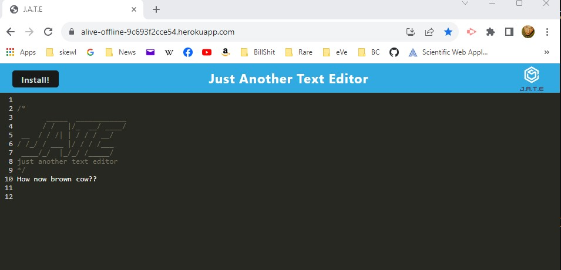
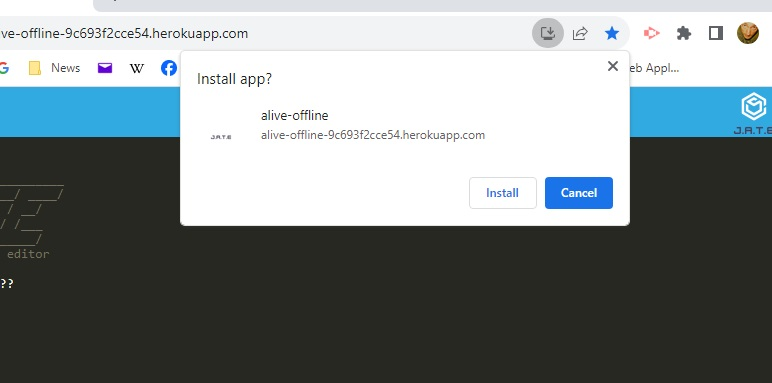
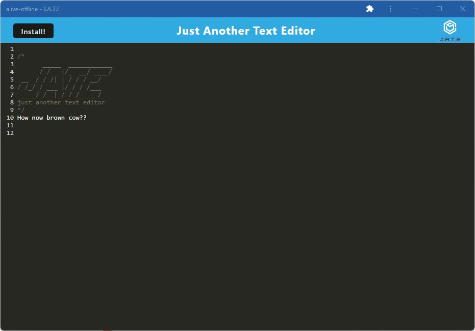

# 19-alive-offline
## Description
This is... Just Another Text Editor that can be downloaded for use offline.

### By: Caine Winters

## Usage
- Navigate to landing page (link below).
- Type into the text editor.
- Data is stored:  subsequent visits will still have what was last left in the editor.
- In the website's address bar there is a download/install option for local use.
- Click this and allow install to use same features as website app.

### Screenshots of app 

## Links
### [Link to repo](https://github.com/elcaine/19-alive-offline)
### [Link to app](https://alive-offline-9c693f2cce54.herokuapp.com/)

### Acknowledged sources
- Activity 28 from this module is the basis for this project.
